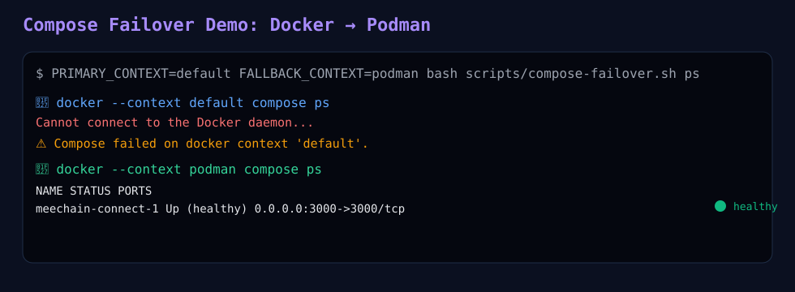

# MeeChain Dashboard


[](https://github.com/MEECHAIN1/MeeChain-Connect/actions/workflows/deploy.yml)


แดชบอร์ด Web Application สำหรับ MeeChain Blockchain Platform

## Prerequisites
- Modern web browser (Chrome, Firefox, Safari, Edge)
- Node.js 18+
- Local web server (`python3 -m http.server`, `npx serve`) หรือรันผ่าน `node server.js`

## Installation
```bash
git clone https://github.com/MEECHAIN1/MeeChain-Connect.git
cd MeeChain-Connect
npm install
```

## Usage
```bash
node server.js
```

เปิดเว็บที่ `http://localhost:3000`

## Contributor onboarding checklist
เอกสาร checklist ฉบับ ritualized สำหรับ contributors:
- `docs/CONTRIBUTOR_CHECKLIST.md`


## RPC Ritual Health Check

This section documents how contributors can verify the health of MeeChain RPC endpoints using `scripts/rpc-check.sh`.

### Overview
The script performs a complete health check across DNS resolution, JSON-RPC method calls, and latency measurement. It supports multiple resolvers and fallback RPC endpoints for reproducible checks.

### Usage
```bash
bash scripts/rpc-check.sh
```

The script runs these checks:
- **DNS Check** — Query the RPC host against multiple public resolvers (default: Cloudflare `1.1.1.1`, Google `8.8.8.8`).
- **RPC Method Check** — Call `eth_chainId` and `eth_blockNumber` to validate JSON-RPC responses.
- **Latency Measurement** — Measure response time for each endpoint.
- **Summary** — Print consolidated results with ritual overlay badges.

### Ritual Overlay
| Step | Action | Ritual Overlay |
|---|---|---|
| DNS Check | Query via multiple resolvers | 🔍 Resolve or Fail |
| RPC Method | Call `eth_chainId` / `eth_blockNumber` | ⛓️ Chain Linked |
| Latency Measure | Curl timing output | ⏱️ Pulse Measured |
| Summary | Print consolidated status | 🎉 Badge Claimed |

### Example Output
```text
🔍 DNS check for rpc.meechain.live
⛓️ RPC check for https://rpc.meechain.live
⏱️ Latency test for https://rpc.meechain.live
-----------------------------------
✅ RPC health check completed
```

### Contributor Milestone
Passing all checks earns the contributor the **RPC Ready Badge** as part of the ritualized onboarding flow.


## Production-safe RPC fallback
รองรับผ่าน env ใน `server.js`:
- `RPC_MODE=auto|upstream-only|mock-only`
- `RPC_ALLOW_MOCK_FALLBACK=true|false`
- `RPC_TIMEOUT_MS=3000`
- `RPC_BREAKER_FAILURE_THRESHOLD=2`
- `RPC_BREAKER_COOLDOWN_MS=60000`

ตรวจสถานะวงจร fallback:
- `GET /api/rpc/status`
- `GET /rpc/health`

## RPC smoke test
```bash
bash scripts/test-rpc.sh https://rpc.meechain.live/rpc https://rpc.meechain.live/health
```

ถ้าอยู่หลัง Cloudflare Access:
```bash
export CF_ACCESS_CLIENT_ID="<client-id>"
export CF_ACCESS_CLIENT_SECRET="<client-secret>"
bash scripts/test-rpc.sh https://rpc.meechain.live/rpc https://rpc.meechain.live/health
```

## Integration test: local `/rpc/health`
```bash
npm run test:rpc:integration
```

เทสต์นี้จะบูต `server.js` ในพอร์ตทดสอบ แล้วตรวจว่า `/rpc/health` และ `/api/rpc/status` ให้ค่า state ถูกต้อง.

## Celebration overlay demo


## External RPC verification
```bash
npm run verify:rpc
# or
bash scripts/verify-rpc-endpoint.sh https://rpc.meechain.live/rpc 10
```

ถ้ามี DNS แยก Cloudflare origin เป็น `origin-rpc.meechain.live` ให้ตรวจแบบ matrix ได้เลย:

```bash
npm run verify:rpc:matrix
# checks both:
# - https://rpc.meechain.live/rpc
# - https://origin-rpc.meechain.live/rpc
```

เทสต์นี้บังคับตรวจทั้ง GET และ POST JSON-RPC เพื่อลด false positive (กรณี GET ตอบ 200 แต่ POST timeout).


## Docker Compose healthcheck
ตอนนี้มี `docker-compose.yml` พร้อม `healthcheck` ที่ตรวจ `GET /rpc/health` ภายใน container เพื่อให้ orchestration รู้สถานะ RPC proxy ได้อัตโนมัติ.

```bash
PRIMARY_CONTEXT=default FALLBACK_CONTEXT=podman npm run compose:up
PRIMARY_CONTEXT=default FALLBACK_CONTEXT=podman npm run compose:ps
```

## Docker → Podman failover demo log
ตัวอย่างผลลัพธ์จริงของ flow failover อยู่ที่:
- `docs/assets/compose-failover-demo.svg`



## External RPC check (ล่าสุด)
ตรวจจาก external network วันที่ **April 27, 2026**:
- `GET https://rpc.meechain.live/rpc` ตอบ `502`
- `POST https://rpc.meechain.live/rpc` (eth_chainId) ตอบ `502`
- สรุป: external endpoint ยังไม่พร้อมสำหรับ wallet client จนกว่า GET/POST จะกลับมาปกติ


## dRPC + Dshackle hybrid setup
สำหรับการใช้ local RPC คู่กับ dRPC ผ่าน proxy เดียว:
- Runbook: `docs/DRPC_DSHACKLE_SETUP.md`
- Config template: `config/dshackle/provider.example.yaml`
- Quick check: `npm run verify:dshackle` (หรือ `bash scripts/check-dshackle-proxy.sh <url>`)


### Compose profile: MeeChain + Dshackle
รัน stack พร้อม Dshackle ด้วย compose ไฟล์เสริม:

```bash
npm run compose:dshackle:up
npm run compose:dshackle:ps
npm run compose:dshackle:down
```

ไฟล์ที่ใช้:
- `docker-compose.yml`
- `docker-compose.dshackle.yml`

> หมายเหตุ: ต้องเตรียมไฟล์ TLS/keys ใน `./secrets/dshackle/*` ก่อนใช้งานจริง


### Compose profile: MeeChain + Dshackle (local dev)
โปรไฟล์นี้ปิด TLS/Auth สำหรับ dev เท่านั้น:

```bash
npm run compose:dshackle:local:up
npm run compose:dshackle:local:ps
npm run compose:dshackle:local:down
```

ไฟล์ที่ใช้:
- `docker-compose.yml`
- `docker-compose.dshackle.local.yml`
- `config/dshackle/provider.local.yaml`


## Docker image migration (old repo -> new org/repo)

ย้าย image จาก repo เดิมไปยัง org/repo ใหม่:

```bash
# 1) Login
docker login

# 2) Pull image เดิม
docker pull meechainv2:tagname

# 3) Re-tag ให้เป็น path ใหม่
docker tag meechainv2:tagname meechainv02/meechainv2:tagname

# 4) Push เข้า repo ใหม่
docker push meechainv02/meechainv2:tagname
```

Checklist flow:
1. ตรวจสอบว่า repo ใหม่ใน org ถูกสร้างแล้ว
2. login ด้วย `docker login` ให้ตรงกับ org
3. pull image เดิมจาก repo เก่า
4. re-tag image ให้ตรงกับ org ใหม่
5. push เข้า repo ใหม่
6. update CI/CD pipeline, README, และ config ให้ใช้ path ใหม่

หมายเหตุ: compose config ปัจจุบันตั้งค่า image เป็น `meechainv02/meechainv2:latest` แล้ว.

## Project Structure
```text
├── index.html          # Main dashboard page
├── explorer.html       # Mee Ritual Chain Explorer
├── dao.html            # Governance / DAO dashboard
├── analytics.html      # Analytics dashboard
├── nft-market.html     # NFT Marketplace
├── server.js           # Local API/server entrypoint
├── worker.js           # Cloudflare Worker entrypoint
├── scripts/            # Ops and deployment scripts
├── src/
│   ├── css/            # Stylesheets
│   ├── js/             # Front-end JavaScript modules
│   └── assets/         # Images and resources
├── scripts/            # Operational helper scripts
├── src/                # Frontend source assets (css/js/images)
├── contracts/          # Smart contracts
├── functions/          # Serverless API functions
├── test/               # Unit/integration tests (legacy set)
└── tests/              # Additional test suites
```

## Deployment Options
MeeChain contributors สามารถ deploy Cloudflare Tunnel ได้สองวิธีหลัก:

### 🗂️ Deploy ผ่าน Project Scripts
เหมาะกับ: Contributor ที่ทำงานบนเครื่องหลัก (PC/Server/CI/CD)

#### Flow
1. Clone project แล้วเข้าไปใน repo.
2. รันสคริปต์ เช่น:
   ```bash
   bash scripts/podman-setup.sh
   bash scripts/rpc-check.sh
   ```
3. สคริปต์จะจัดการ install, config, health check และ fallback อัตโนมัติ.
4. ผลลัพธ์ reproducible ทำให้ contributor ทุกคนได้ flow เดียวกัน.

#### ข้อดี
- Automation สูง ลด human error
- ใช้ได้กับ CI/CD pipeline
- Ritualized milestone ชัดเจน

### 📱 Deploy ผ่าน Termux (Mobile)
เหมาะกับ: Contributor ที่ต้องการความยืดหยุ่นและ portable environment


## CPAN Ritual Onboarding (Termux)
สำหรับ contributor ที่ต้องการยืนยันว่า CPAN พร้อมใช้งานใน Termux สามารถใช้สคริปต์นี้ได้:

```bash
./scripts/test_cpan.sh
```

หากแสดงข้อความ `🎉 CPAN พร้อมใช้งานแล้ว → Badge Claimed!` ถือว่าผ่าน milestone.
#### Flow
1. เปิด Termux แล้วติดตั้ง `cloudflared` และ dependencies.
2. รันคำสั่งตรง ๆ:
   ```bash
   cloudflared tunnel run 66b8d43c-39f8-4ee1-97db-13cb718825cd
   ```
3. Connector ID จะถูกสร้างใหม่ทุกครั้ง แต่ผูกกับ Tunnel ID เดียวกัน.
4. ใช้ `scripts/rpc-check.sh` ได้เช่นกัน ถ้า copy script เข้า Termux.

#### ข้อดี
- Portable ใช้ได้แม้ไม่มีเครื่องหลัก
- เหมาะกับ contributor ที่ onboard ผ่านมือถือ
- Tunnel ทำงานจริงแม้มี warning (เช่น `ping_group_range`, `origin lookup`)

### 🎉 Contributor Milestone
- Project Scripts → Automation, reproducible, CI/CD ready
- Termux → Portable, flexible, mobile onboarding

ทั้งสองวิธีถือว่า valid และสามารถใช้ร่วมกันได้ตามสถานการณ์.


## Cloudflare Tunnel
ตัวอย่าง config: `cloudflared/config.yml.example`

```bash
cp cloudflared/config.yml.example ~/.cloudflared/config.yml
cloudflared tunnel run meechain-connect
```
