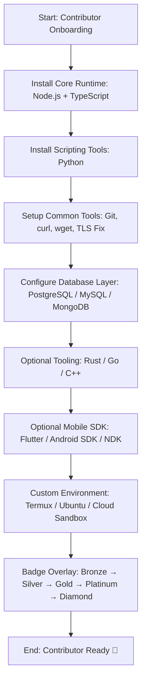

# 📋 Contributor Checklist: Wallet & RPC Onboarding

## 1) Preflight Health Check
- Endpoint: `GET /rpc/health`
- Payload: ใช้โครงสร้างเดียวกับ `/health` และเพิ่ม `mode` + `rpcState`
- Purpose: ให้ Wallet/MetaMask ตรวจ local proxy ก่อนเชื่อมต่อ
- ✅ ต้องได้ response JSON ที่ถูกต้อง

## 2) MetaMask Connection Flow
- Function: `ensureMeeChainNetwork()`
- รองรับ error code `4200` แบบ explicit
- Fallback: `wallet_addEthereumChain`
- มีข้อความแนะนำเมื่อ wallet ไม่รองรับ switch chain อัตโนมัติ

## 3) RPC Proxy Default
- `wallet.js` ใช้ `rpcUrls[0] = location.origin + '/rpc'`
- `server.js` (`/api/network`) ส่ง local proxy เป็น RPC URL ลำดับแรกเสมอ
- README ระบุชัดว่า contributors ต้องใช้ local proxy `/rpc` เป็น default

## 4) Celebration Overlay
- Overlay หลังเชื่อมต่อสำเร็จ:
  - MetaMask: `✅ RPC Connected → 🎉 Badge Claimed`
  - Demo Wallet: `✅ RPC Connected → 🎉 Badge Claimed`
- มี style overlay เพื่อ visual feedback ชัดเจน

## 5) External RPC Status
- ตรวจทั้ง public + origin DNS:
  - `https://rpc.meechain.live/rpc`
  - `https://origin-rpc.meechain.live/rpc`
  (ต้องเช็คทั้ง GET และ POST JSON-RPC)
- สถานะล่าสุด (May 4, 2026): public ตอบ `530` (error code: 1033) และ origin ตอบ `503` (DNS resolution failure)
- สรุป: endpoint ภายนอกยังไม่พร้อมสำหรับ wallet client จนกว่า POST จะตอบ JSON-RPC ปกติ
- Contributors ต้องใช้ local proxy `/rpc` เป็น default

## 6) Testing Checklist
- ✅ `node --check server.js`
- ✅ `node --check src/js/wallet.js`
- ✅ `bash -n scripts/test-rpc.sh`
- ✅ `npm run test:rpc:integration`
- ✅ `node server.js` (รันขึ้นได้และตอบ `/rpc/health` + JSON-RPC ผ่าน local proxy)
- ✅ `npm run verify:rpc:matrix`

---

## 🎯 Key Takeaways
- ใช้ local proxy `/rpc` เป็น default เสมอ
- เช็ค `/rpc/health` ก่อน add/switch network
- รองรับ code `4200` พร้อม fallback และคำแนะนำ
- Celebration overlay = ritualized feedback สำหรับ contributors
- External RPC ยังไม่เสถียร จึงไม่ควรเป็น default

---

## 🧭 MeeChain Contributor Ritual Flow (Package Installation Path)

### 🔎 Flow Interpretation
- Bronze → Node.js + TypeScript (MeeChain core)
- Silver → Python + Common Tools (script automation, reproducibility)
- Gold → Database Layer (PostgreSQL/MySQL/MongoDB)
- Platinum → Rust/Go/C++ + Mobile SDK (performance and mobile client extensions)
- Diamond → Custom Environment + Badge Overlay (ritualized onboarding flow)

## 🏅 Achievement Badge Overlay Table

| Tier | Badge | Achievement Condition | Check-in / Evidence |
|---|---|---|---|
| Bronze | Core Runtime Installed | ติดตั้ง Node.js + TypeScript ครบ | `node -v`, `npm -v`, `tsc -v` |
| Silver | Tools Ready | ติดตั้ง Python + Common Tools (Git, curl, wget, TLS fix) | `python --version`, `git --version`, `curl --version`, `wget --version` |
| Gold | Database Configured | เชื่อมต่อ DB ได้อย่างน้อย 1 ระบบ (PostgreSQL/MySQL/MongoDB) | connection test หรือ migration แรกผ่าน |
| Platinum | Performance & Mobile Ready | ติดตั้ง Rust/Go/C++ และ/หรือ Mobile SDK | `rustc --version`, `go version`, `g++ --version`, `flutter doctor` |
| Diamond | Ritual Flow Complete | ตั้งค่า environment ที่ใช้งานจริง (Termux/Ubuntu/Cloud Sandbox) และผ่านทุก milestone | checklist 100% + ลิงก์หลักฐานการติดตั้ง |

> แนะนำให้ใช้ตารางนี้ใน PR หรือ onboarding issue template เพื่อให้ contributor เช็คอินความคืบหน้าได้แบบ gamified และตรวจสอบย้อนกลับได้ง่าย
