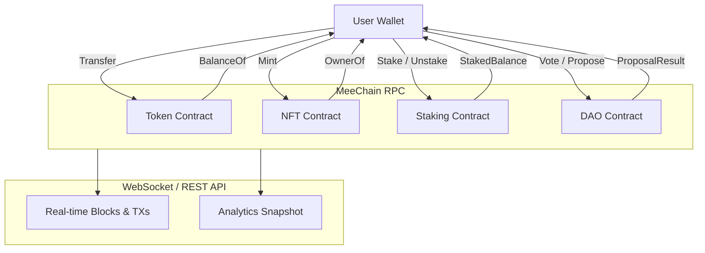

# 🧾 MeeChain Smart Contract RPC Cheat Sheet

เอกสารนี้รวมฟังก์ชันหลักของสัญญา Token, NFT, Staking, DAO พร้อมคำสั่ง `cast` แบบ copy-paste สำหรับทดสอบผ่าน RPC

> RPC หลัก: `https://rpc.meechain.live/rpc`  
> Chain ID: `13390` (hex: `0x344e`)

## Contract Addresses (Default)

- Token: `0x5FbDB2315678afecb367f032d93F642f64180aa3`
- NFT: `0xe7f1725E7734CE288F8367e1Bb143E90bb3F0512`
- Staking/Portal: `0x9fE46736679d2D9a65F0992F2272dE9f3c7fa6e0`
- DAO: `0x0165878A594ca255338adfa4d48449f69242Eb8F`

> หมายเหตุ: หาก environment ของคุณ override address ผ่าน `VITE_*` หรือ worker env ให้ใช้ค่าที่ `/api/network` ส่งกลับเป็นหลัก

---

## 🪙 Token Contract

### อ่าน Balance
```bash
cast call 0x5FbDB2315678afecb367f032d93F642f64180aa3 \
  "balanceOf(address)(uint256)" 0xYourWalletAddress \
  --rpc-url https://rpc.meechain.live/rpc
```

### โอน Token
```bash
cast send 0x5FbDB2315678afecb367f032d93F642f64180aa3 \
  "transfer(address,uint256)" 0xRecipientAddress 100 \
  --rpc-url https://rpc.meechain.live/rpc
```

---

## 🎨 NFT Contract

### Mint NFT
```bash
cast send 0xe7f1725E7734CE288F8367e1Bb143E90bb3F0512 \
  "safeMint(address,string)" 0xYourWalletAddress "ipfs://your-metadata-uri" \
  --rpc-url https://rpc.meechain.live/rpc
```

### เช็ค Owner ของ NFT
```bash
cast call 0xe7f1725E7734CE288F8367e1Bb143E90bb3F0512 \
  "ownerOf(uint256)(address)" 1 \
  --rpc-url https://rpc.meechain.live/rpc
```

---

## 🔒 Staking Contract

### Stake Token
```bash
cast send 0x9fE46736679d2D9a65F0992F2272dE9f3c7fa6e0 \
  "stake(uint256)" 1000 \
  --rpc-url https://rpc.meechain.live/rpc
```

### Unstake Token
```bash
cast send 0x9fE46736679d2D9a65F0992F2272dE9f3c7fa6e0 \
  "unstake(uint256)" 500 \
  --rpc-url https://rpc.meechain.live/rpc
```

### ดูจำนวนที่ Stake อยู่
```bash
cast call 0x9fE46736679d2D9a65F0992F2272dE9f3c7fa6e0 \
  "stakedBalance(address)(uint256)" 0xYourWalletAddress \
  --rpc-url https://rpc.meechain.live/rpc
```

---

## 🏛 DAO Contract

### Vote
```bash
cast send 0x0165878A594ca255338adfa4d48449f69242Eb8F \
  "vote(uint256,bool)" 1 true \
  --rpc-url https://rpc.meechain.live/rpc
```

### ดูผลโหวต
```bash
cast call 0x0165878A594ca255338adfa4d48449f69242Eb8F \
  "proposalResult(uint256)(uint256,uint256)" 1 \
  --rpc-url https://rpc.meechain.live/rpc
```

---

## 📜 Mermaid Flow (Token → NFT → Stake → DAO)


